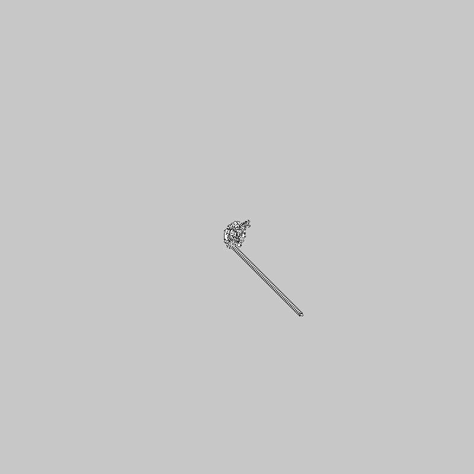
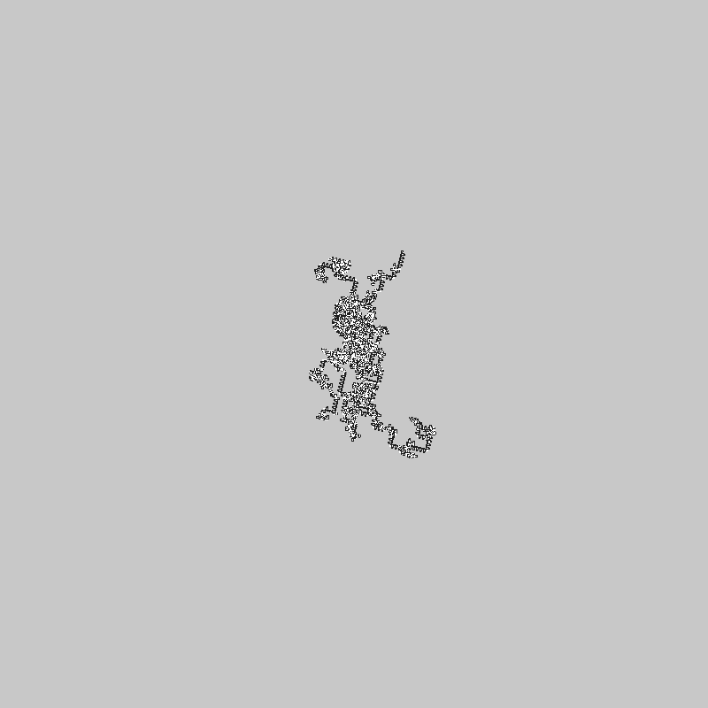

# Anarchy Ants
What if Langton's ant could turn whatever angle it wanted?
Well, this is that.

## Requirements
python2.7
pygame

## Examples

### Classic Langton's ant
Ant(1,90)

### 5 30 degree ants
Ant(5,30,True)

### 90.2 degree ant
Ant(1,90.2)

